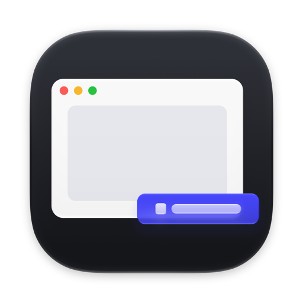
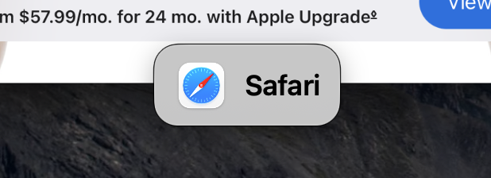
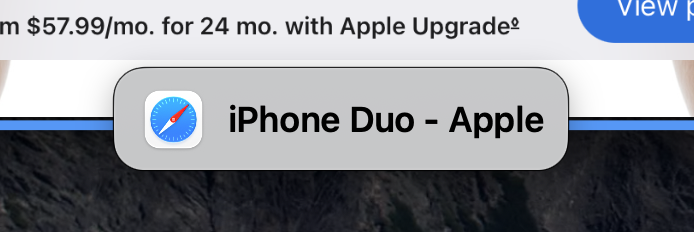

<!-- PROJECT LOGO -->
 

  
  <h3 align="center">Callsign</h3>
  

    Custom tags for Mission Control windows
     
  

<!-- ABOUT-->
## About

<!-- Demo video -->
https://github.com/user-attachments/assets/5642cb45-4298-4b81-8ac6-0b3612a1a0a8

Callsign adds tags to windows in Mission Control, showing the app name or window title so you can quickly tell them apart.

<!-- Getting Started -->
## Getting Started

### Requirements

- macOS 26 Tahoe or later
- Tested on Apple silicon Macs. The app is a universal build, but it hasn't been tested on Intel Macs.

### Installation

Go to the [releases page](https://github.com/shylee2021/callsign/releases), download and unzip the latest release, and move `Callsign.app` to your `Applications` folder.

### Quick start

> [!IMPORTANT]
> Callsign needs Accessibility access to detect Mission Control and read window titles. Without it, no tags appear.

1. Open Callsign. Settings open automatically on first launch.
2. Click **Grant Accessibility Access** in General settings and enable Callsign in System Settings > Privacy & Security > Accessibility.
3. Open Mission Control. Tags appear while Callsign is running.
4. To customize the tags, click Callsign's menu bar icon and choose **Settings… > Appearance**.

You can also pause or resume Callsign from the menu bar. Closing Settings keeps Callsign running.

<!-- Features -->
## Features

- Show the app name, window title, or just the app icon

  <table>
    <tr>
      <td align="center"></td>
      <td align="center"></td>
    </tr>
    <tr>
      <td align="center">App name</td>
      <td align="center">Window title</td>
    </tr>
  </table>

- Customize tag appearance
  - Position
  - Size
  - Text and background colors
  - Liquid Glass

## Caveats

### Known limitations

Support for Mission Control's **Group windows by application** mode is limited. For now, use Mission Control with grouping turned off.

### Depends on undocumented macOS behavior

Callsign relies on the Dock's accessibility tree and private APIs to display tags in Mission Control. macOS updates may break the tags until Callsign is updated.

### AI-assisted development

I built Callsign with substantial help from AI. I'm still reviewing and cleaning up the code.

<!-- ROADMAP -->
## Roadmap

- [ ] Tag content configuration
  - [ ] Length limit
  - [ ] Truncation
  - [ ] Custom content, e.g. `AppName (WindowName[:10]...)`
- [ ] Localization
- [ ] Project configuration
  - [ ] Swift lint/format config
  - [ ] AGENTS.md
- [ ] Contribution materials
  - [ ] Contribution guide
  - [ ] Issue template
- [ ] Developer documentation (e.g. architecture overview)
- [ ] Homebrew tap
- [ ] Better support for grouped window mode
- [ ] Per-app tag configuration

<!-- LICENSE -->
## License

Distributed under the MIT license. See `LICENSE` for more information.
